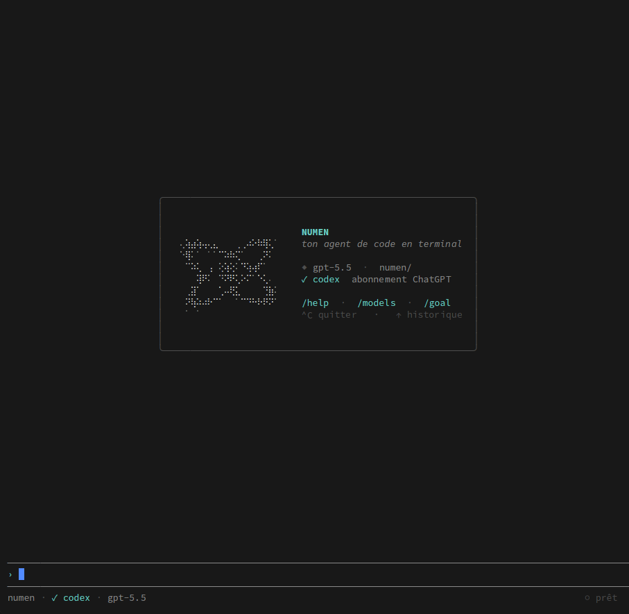

# Pyxis

<p align="center">
  
  
  
  
  <a href="LICENSE"></a>
</p>

**A native, model-agnostic AI coding agent that lives in your terminal.** `pyxis` opens straight in your shell, streams a model, runs real tools (read, grep, edit, bash), and loops until the work is done, all from a single Rust binary with no Node runtime underneath.

Pyxis is built around a **headless core** (`agent-core`) that emits only structured events, never ANSI. The terminal UI is just one client. That same core is meant to be embedded in-process by [Paneflow](https://paneflow.dev) (Zed's GPUI) for GPU-accelerated diffs and plan trees later, without forking any agent logic. The provider layer is multi-provider by design (a clean `Provider` trait + an Anthropic-shaped canonical format), so new model backends drop in as isolated adapters.

> *Pyxis* is the compass. A small instrument for keeping direction while the agent navigates a large codebase, chooses files, edits precisely, and returns with a diff you can trust.

<p align="center">
  <a href="#status">Status</a> ·
  <a href="#quickstart">Quickstart</a> ·
  <a href="#features">Features</a> ·
  <a href="#how-it-works">How it works</a> ·
  <a href="#usage">Usage</a> ·
  <a href="#roadmap">Roadmap</a> ·
  <a href="#faq">FAQ</a>
</p>

<p align="center">
  
</p>
<p align="center">
  <sub>The welcome screen: a native terminal agent on your ChatGPT subscription (gpt-5.5 via codex), monochrome, no window.</sub>
</p>

```console
$ pyxis
  pyxis · gpt-5.5 · ~/dev/myproject

› refactor the auth module to drop unwrap() in prod paths

  ⠋ read   crates/auth/src/token.rs
  ⠙ edit   crates/auth/src/token.rs   (3 hunks)
  ✓ bash   cargo clippy --no-deps  ·  0 warnings

  Replaced 4 unwrap() with ? / ok_or(...). Diff above.

# headless, scriptable, no TUI
$ pyxis -p "summarize the changes in the last commit"
```

## Status

**Early, single-provider, Linux-first. No packaged releases yet, you build from source.** This is an honest snapshot, not a roadmap fantasy:

- **It runs today.** The agentic loop, the tool suite, the Linux filesystem sandbox, JSONL sessions with resume, MCP configuration/diagnostics, and the monochrome TUI all work.
- **One model channel ships so far: your ChatGPT subscription.** GPT / Codex models served through the Codex backend (Responses API, SSE, stateless). The provider layer is written multi-provider from day one, but this is the only adapter wired up. Anthropic, OpenAI BYOK, Gemini, and others are architecture-ready, not yet built. See [Roadmap](#roadmap).
- **Linux is the supported platform.** The filesystem sandbox uses Landlock (Linux kernel) and credentials use the Secret Service keyring. macOS Seatbelt and broader support come later; off-Linux, FS confinement degrades explicitly.
- **The subscription auth is unofficial and revocable.** It reuses the open-source Codex CLI OAuth client, which is ToS-grey and could be cut off at any time (it happened to Anthropic Pro/Max for third-party tools in 2026). Treat it as a convenience, not a foundation. See [Authentication](#authentication).

## Quickstart

You need a Rust toolchain (1.95+) and a Linux desktop session with a Secret Service keyring (GNOME Keyring or KWallet) for credential storage.

```bash
# 1. Build from source
git clone https://github.com/arthjean/pyxis.git
cd pyxis
cargo build --release          # produces target/release/pyxis

# 2. Authenticate with your ChatGPT subscription (OAuth, opens a browser)
cargo run -p agent-auth --example login

# 3. Run it in any project directory
cd ~/dev/myproject
/path/to/pyxis/target/release/pyxis
```

Drop `target/release/pyxis` on your `PATH` (or `cargo install --path crates/agent-cli`) to call `pyxis` from anywhere.

## Where it fits

Pyxis overlaps with every terminal coding agent, but the design center is specific: **a native, model-agnostic agent whose core is built to be embedded in a GPU terminal workspace.**

| Tool | Strength | Pyxis's angle |
|---|---|---|
| Claude Code | Polished Anthropic-native agent, large ecosystem | Model-agnostic core by design; one native Rust binary, no Node runtime |
| Codex CLI | OpenAI-native, strong sandboxing | Reuses the ChatGPT-subscription channel, but ships a headless core meant to embed in Paneflow |
| aider / opencode | Mature multi-model OSS agents | Rust-native, kernel-level FS sandbox (Landlock), shared core with a GPU terminal workspace |
| Paneflow | Runs CLI agents in parallel GPU panes | Pyxis is the agent; Paneflow is the surface. The plan is to embed `agent-core` in-process, no IPC |

The honest caveat: most rows describe a *direction*. Today Pyxis ships one provider and one frontend. The bet is in the architecture (headless core + provider trait), not in a checklist.

## Features

Shipped today:

- **Agentic loop**: stream → tool → loop, driven by a compiler-checked transition state machine. The model calls tools, sees results, and continues until it ends the turn.
- **Built-in tool suite**: `read`, `glob`, `grep`, `write`, `edit`, `bash`. Concurrency-safe reads run in parallel; mutations run serially.
- **Fail-closed permissions + taint**: every tool is dangerous until proven otherwise. Tool output is untrusted by default (OWASP LLM01); a destructive or network action in a turn that just read untrusted content is forced to ask, regardless of mode.
- **Execution sandbox**: Landlock confines writes to the workspace on Linux (the agent *and* its `bash` subprocesses); a local proxy gates cooperative outbound HTTP(S) subprocess traffic via `--allow <host>`.
- **Persistent sessions**: one append-only JSONL file per conversation under `.pyxis/sessions/`, with `/resume` to reopen a past session and a workspace-wide prompt history.
- **`/goal` completion loop**: set a session objective and Pyxis re-runs the agentic loop until it emits a done marker (capped at 25 iterations), persisted in a `.pyxis/goal` sidecar so it survives restarts.
- **MCP config and diagnostics (stdio)**: load servers from `.mcp.json` or your existing `~/.claude.json`, inspect lifecycle state, and list exposed tools from the `/mcp` submenu. Exposing MCP tools to the model loop is still future work.
- **Markdown rendering**: assistant replies are rendered to styled spans (CommonMark + GFM).
- **Monochrome Ratatui UI**: clean, modern, Rauch/Vercel-flavored, with a braille Dyson-sphere logo and a welcome screen, not a double-bordered retro TUI.
- **Headless mode**: `pyxis -p "..."` runs without the TUI, so the core is scriptable and testable without a terminal or a live API.
- **ChatGPT subscription auth**: OAuth PKCE, refresh-token rotation, credentials in the OS keyring (never in plaintext).

Architecture-ready, not yet built:

- Additional provider adapters (Anthropic, OpenAI BYOK, Gemini) behind the same `Provider` trait
- Paneflow in-process embedding with GPU diffs, plan trees, and hunk review
- Vector memory (`sqlite-vec`), sub-agents, prompt-caching strategy, VCR provider tests

## How it works

Pyxis is a Cargo workspace. The crates are named `agent-*` internally; the published binary and command are `pyxis` (see [`docs/DECISIONS.md`](docs/DECISIONS.md), ADR-8).

```
                         ┌──────────────────────────────┐
                         │          agent-core           │
                         │  loop + state machine +       │
                         │  canonical types (headless)   │
                         │  emits: Stream<AgentEvent>    │
                         └──────────────┬───────────────┘
                                        │  structured events (never ANSI)
                 ┌──────────────────────┼──────────────────────┐
                 ▼                      ▼                      ▼
        ┌─────────────────┐    ┌─────────────────┐    ┌──────────────────┐
        │   agent-tui     │    │   mode -p       │    │ Paneflow (GPUI)  │
        │ Ratatui client  │    │ headless print  │    │ embed in-process │
        │ (terminal)      │    │ (text / JSON)   │    │ GPU render (next)│
        └─────────────────┘    └─────────────────┘    └──────────────────┘
```

The founding invariant: **`agent-core` depends on neither the TUI nor the provider layer** (only on `agent-tokenizer`, which is also headless). I/O is injected through traits, so the loop is testable without network, terminal, or a real model. The provider layer normalizes heterogeneous wire formats into one Anthropic-shaped canonical format, with divergences localized per adapter.

| Crate | Role |
|---|---|
| `agent-core` | Agent loop, transition state machine, canonical message/transcript types (headless) |
| `agent-provider` | `Provider` trait + adapters (reqwest + SSE), canonical `StreamEvent`, error taxonomy |
| `agent-tools` | Tool registry, fail-closed trait, concurrent/serial dispatch, permissions, taint |
| `agent-mcp` | `rmcp`-based MCP client (stdio), config loading, server registry |
| `agent-tui` | Ratatui + crossterm frontend, decoupled from the core via channels |
| `agent-session` | Append-only JSONL persistence, resume, compaction boundaries |
| `agent-sandbox` | Landlock FS confinement + local network allow-list proxy |
| `agent-auth` | Credential storage (keyring), OAuth PKCE, token refresh |
| `agent-tokenizer` | Local token counting (fallback when a provider omits stream usage) |
| `agent-cli` | The `pyxis` binary, the only crate that wires everything together |

Full detail in [`docs/ARCHITECTURE.md`](docs/ARCHITECTURE.md).

## Authentication

Pyxis authenticates with your **ChatGPT subscription** (Plus / Pro), not a metered API key. The flow:

```bash
cargo run -p agent-auth --example login
```

This runs OAuth PKCE against `auth.openai.com`, then talks to the ChatGPT backend's Responses API (`chatgpt.com/backend-api/codex/responses`) in stateless SSE mode, so the full transcript is sent each turn and compaction / resume / replay stay intact. Tokens are stored in the OS keyring and refreshed automatically.

**Read this before you rely on it.** The login reuses the OAuth client of the open-source Codex CLI, which effectively impersonates Codex. That is ToS-grey and **revocable**: OpenAI could disable this client at any time, exactly as Anthropic blocked third-party tools from using Pro/Max subscriptions in 2026. Pyxis treats the subscription as a disposable convenience layer, not a foundation. The day it breaks, adding a BYOK adapter (Chat Completions, Anthropic, ...) is an isolated module, not a rewrite. The model-agnostic architecture is the insurance policy. See [`docs/DECISIONS.md`](docs/DECISIONS.md) (ADR-10, ADR-11) and [`docs/openai-subscription-auth.md`](docs/openai-subscription-auth.md).

## Build from source

### Rust toolchain

Pyxis uses Rust **1.95+** (edition 2024). Install via [rustup](https://rustup.rs/):

```bash
curl --proto '=https' --tlsv1.2 -sSf https://sh.rustup.rs | sh
```

### Linux system dependencies

Credential storage uses the Secret Service API, so you need a keyring daemon (GNOME Keyring or KWallet) and its dev headers. TLS uses rustls, so OpenSSL is not required.

**Fedora:**
```bash
sudo dnf install gcc pkgconf-pkg-config libsecret-devel
```

**Debian / Ubuntu:**
```bash
sudo apt install build-essential pkg-config libsecret-1-dev
```

### Build and test

```bash
cargo build --release          # binary at target/release/pyxis
cargo test --workspace         # headless core is fully testable without a live API
```

The filesystem sandbox needs a Linux kernel with Landlock (5.13+, ABI improvements through 6.x). Without it, Pyxis warns and runs unconfined rather than failing closed.

## Usage

```bash
pyxis                          # interactive TUI in the current directory
pyxis -p "<prompt>"            # headless one-shot, prints the answer and exits
pyxis "<prompt>"               # bare prompt is treated as -p
```

### Flags

| Flag | Effect |
|------|--------|
| `--model <slug>` | Pick the model (default `gpt-5.5`). Also switchable in-session via `/models`. |
| `--allow <host>` | Add a host to the network allow-list for tool subprocesses (repeatable). |
| `--resume [id.jsonl\|latest]` | Reopen the latest or named session before entering the TUI, or continue it with `-p`. |
| `--yes`, `-y` | Auto-approve tool actions (headless / trusted automation). |
| `--no-sandbox` | Disable Landlock FS confinement (writes are no longer confined to the workspace). |

### Slash commands (interactive)

| Command | Action |
|---------|--------|
| `/help` | List available commands |
| `/models` | Switch the active model for this session |
| `/goal` | Set an objective and work until it is reached |
| `/skills` | Insert a skill from `~/.agents/skills` into the message |
| `/providers` | Inspect / configure the auth provider |
| `/mcp` | Manage MCP server connections |
| `/resume` | Reopen a past conversation |
| `/new`, `/clear` | Start fresh (clear the context) |
| `/quit` | Exit |

### Models

The Codex backend accepts a whitelist of versioned slugs it rotates. The generic `gpt-5` slug is rejected; use a versioned one:

`gpt-5.5` (default) · `gpt-5.4` · `gpt-5.4-mini` · `gpt-5.3-codex-spark`

## Files and configuration

Pyxis reads and writes a few well-known paths:

| Path | Purpose |
|------|---------|
| `<workspace>/.pyxis/sessions/*.jsonl` | One append-only transcript per conversation; backs `/resume` |
| `<workspace>/.pyxis/goal` | Persistent `/goal` objective (survives restarts) |
| `<workspace>/.mcp.json` | Workspace MCP servers (highest priority) |
| `~/.claude.json` | Reused `mcpServers` from Claude Code, merged underneath |
| `~/.agents/skills/<name>/` | Skills surfaced by `/skills` (one directory per skill) |

These paths outside the workspace (skills, MCP config, keyring) are read **before** the Landlock sandbox is applied, since they would be unreachable afterward.

## Sandbox and security

- **Filesystem**: Landlock confines every write to the workspace, kernel-level, inherited by `bash` subprocesses (the FS sandbox is applied on the main thread before the Tokio runtime is built, so workers inherit it).
- **Network**: a local CONNECT proxy with an allow-list for cooperative HTTP(S) subprocesses. Tool subprocesses get `HTTP(S)_PROXY` pointing at it (`--allow` opens specific hosts), but raw sockets are not kernel-confined. The agent's own provider calls go direct.
- **Prompt injection (OWASP LLM01)**: tool output is tainted as untrusted and the taint propagates; a destructive or network action following recent taint is forced to ask.
- **Fail-closed tools**: a tool that declares nothing is treated as non-concurrent, mutating, and untrusted.
- **Credentials**: OAuth tokens live in the OS keyring, never in plaintext on disk.

## Roadmap

The MVP target was deliberately narrow: **make Pyxis excellent with one model channel (the ChatGPT subscription) and dogfood it daily**, rather than ship six empty provider columns. The multi-provider architecture is the invariant; adapters land incrementally.

- **Now (shipped)**: agentic loop, tool suite + Linux FS sandbox, sessions + resume, `/goal`, MCP config/diagnostics, monochrome TUI, ChatGPT subscription provider.
- **Next**: more provider adapters behind the existing `Provider` trait, MCP tools wired into the model loop, stable MCP connect UX, Paneflow in-process embedding (GPU diffs, plan trees, hunk review).
- **Later**: vector memory (`sqlite-vec`), sub-agents, macOS Seatbelt hardening, VCR provider tests in CI.

Phases and the de-risking spikes live in [`docs/ROADMAP.md`](docs/ROADMAP.md).

## Documentation

| Document | Contents |
|---|---|
| [`docs/ARCHITECTURE.md`](docs/ARCHITECTURE.md) | Crate workspace, agent loop, tool pipeline, compaction, sessions, sandbox |
| [`docs/CURRENT_STATUS.md`](docs/CURRENT_STATUS.md) | Current shipped scope, deferred features, and live risks after ADR-11 |
| [`docs/PROVIDERS.md`](docs/PROVIDERS.md) | Provider trait, canonical format, per-provider divergences, retry and caching |
| [`docs/DECISIONS.md`](docs/DECISIONS.md) | Architecture decision records (language, frontend, naming, providers, risks) |
| [`docs/ROADMAP.md`](docs/ROADMAP.md) | Phases, de-risking spikes, sequencing |
| [`docs/openai-subscription-auth.md`](docs/openai-subscription-auth.md) | ChatGPT subscription auth mechanics |

## FAQ

**Why Rust and not TypeScript like Claude Code?**
The whole point is sharing a core with Paneflow, which is GPUI (Rust). A Rust core can be embedded in-process with shared types and no IPC. A TS core hits an FFI wall. The accepted cost is slower solo dev velocity; the mitigation is a tight scope and decoupled, testable crates.

**Why does it only work with a ChatGPT subscription today?**
Sequencing, not abandonment. The author orchestrates agents all day and wanted *his* model working perfectly first, then to add other providers over time. The `Provider` trait keeps the door open; the canonical format and retry/auth layers already exist.

**Is this allowed? Will my account get banned?**
The subscription login reuses the open-source Codex CLI's OAuth client, which is unofficial and ToS-grey. It works for personal use and is revocable. If that risk is unacceptable to you, wait for the BYOK adapters.

**Can I use my Anthropic Max subscription?**
No. Anthropic blocks third-party tools from authenticating with Pro/Max subscriptions. That is precisely why Pyxis is model-agnostic by design and does not depend on any single subscription channel.

**Is this a Claude Code wrapper?**
No. It is an independent Rust implementation inspired by Claude Code's internal architecture (headless loop, transcript-before-response, compaction cascade, fail-closed tools), not a shell over it.

**Is it ready for daily use?**
It is dogfooded daily by its author on Linux, but it is early: one provider, no releases, Linux-first, and a revocable auth channel. Build from source and expect rough edges.

**Why GPL-3.0?**
Pyxis is free and open source by design, and copyleft keeps it that way: improvements to the agent stay in the commons, and the shared core cannot be forked into a closed product.

**How does it relate to Paneflow?**
Paneflow runs CLI agents in parallel GPU panes; Pyxis is one such agent. The deeper plan is for Paneflow to embed `agent-core` in-process and render its events natively (GPU diffs, plan trees). That embedding is future work; the decoupling that makes it possible exists today.

## License

[GPL-3.0-or-later](LICENSE). Pyxis is free and open source by design, and copyleft keeps it that way: improvements stay in the commons.
