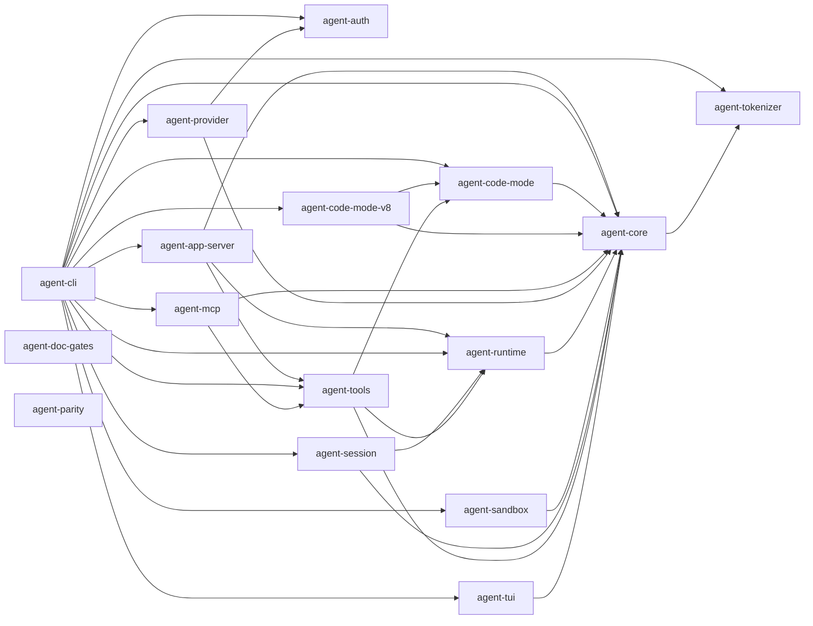

<!-- Généré par crates/agent-doc-gates/src/crate_graph.rs ; ne pas éditer à la main. -->
<!-- Régénérer : PYXIS_UPDATE_CATALOGS=1 cargo test -p agent-doc-gates --test crate_graph -->

# Graphe de crates

Les 16 crates de `crates/` et leurs arêtes internes, dérivés de leurs manifestes.
Le rôle d'un crate est le champ `description` de son propre `Cargo.toml` : il se corrige
là, jamais ici, et ce document est réécrit par la commande de son en-tête.

Une arête est une entrée `agent-*` d'une section `[dependencies]`, y compris
conditionnelle par cible. `[dev-dependencies]` et `[build-dependencies]` sont exclues :
elles ne disent pas de quoi un binaire publié dépend. Les dépendances externes ne
figurent pas ici, chacune étant argumentée dans le manifeste qui la porte. Les
dépendances qu'un crate s'interdit sont un invariant et non un fait dérivable : elles
restent écrites dans [`ARCHITECTURE.md`](ARCHITECTURE.md).

| Crate | Rôle | Dépend de |
|---|---|---|
| `agent-app-server` | The external client contract: JSON-RPC surface, thread/turn/item projection and transports, with the runtime assembly left to the binary. | `agent-core`, `agent-runtime`, `agent-tools` |
| `agent-auth` | Credential storage in the OS keyring, ChatGPT OAuth PKCE login and token refresh. | aucune |
| `agent-cli` | The published `pyxis` binary, the only crate that wires everything together. | `agent-app-server`, `agent-auth`, `agent-code-mode`, `agent-code-mode-v8`, `agent-core`, `agent-mcp`, `agent-provider`, `agent-runtime`, `agent-sandbox`, `agent-session`, `agent-tokenizer`, `agent-tools`, `agent-tui` |
| `agent-code-mode` | Code Mode session protocol and cell state machine, deliberately free of any JavaScript engine. | `agent-core` |
| `agent-code-mode-v8` | V8 engine behind the `CellEngine` contract, the only crate in the workspace that costs a statically linked V8. | `agent-code-mode`, `agent-core` |
| `agent-core` | Agent loop, transition state machine and the canonical message, transcript and budget types, headless by construction. | `agent-tokenizer` |
| `agent-doc-gates` | Documentation gates: reads the repository's own documents and reports what does not conform. | aucune |
| `agent-mcp` | MCP client over `rmcp` (stdio and Streamable HTTP) exposing the tools of a configured server as `DynTool`. | `agent-core`, `agent-tools` |
| `agent-parity` | Baseline verifier: derives the frozen contract matrices from the read-only Codex clone pinned at its baseline commit. | aucune |
| `agent-provider` | The `Provider` trait and its adapters, normalizing heterogeneous wire formats into one canonical `StreamEvent`. | `agent-auth`, `agent-core` |
| `agent-runtime` | Durable thread runtime: turn lifecycle, bounded mailbox, steering, hierarchical cancellation, forks and the `ThreadStore` contract. | `agent-core` |
| `agent-sandbox` | Execution sandbox: Landlock filesystem confinement and the local network allow-list proxy. | `agent-core` |
| `agent-session` | Append-only JSONL persistence, resume, compaction boundaries, and the JSONL adapter of `ThreadStore`. | `agent-core`, `agent-runtime` |
| `agent-tokenizer` | Local token counting, the fallback used for compaction when a provider omits stream usage. | aucune |
| `agent-tools` | Tool registry, fail-closed `Tool` trait, concurrent and serial dispatch, permissions and taint propagation. | `agent-code-mode`, `agent-core`, `agent-runtime` |
| `agent-tui` | Ratatui and crossterm terminal frontend, decoupled from the core through channels. | `agent-core` |
